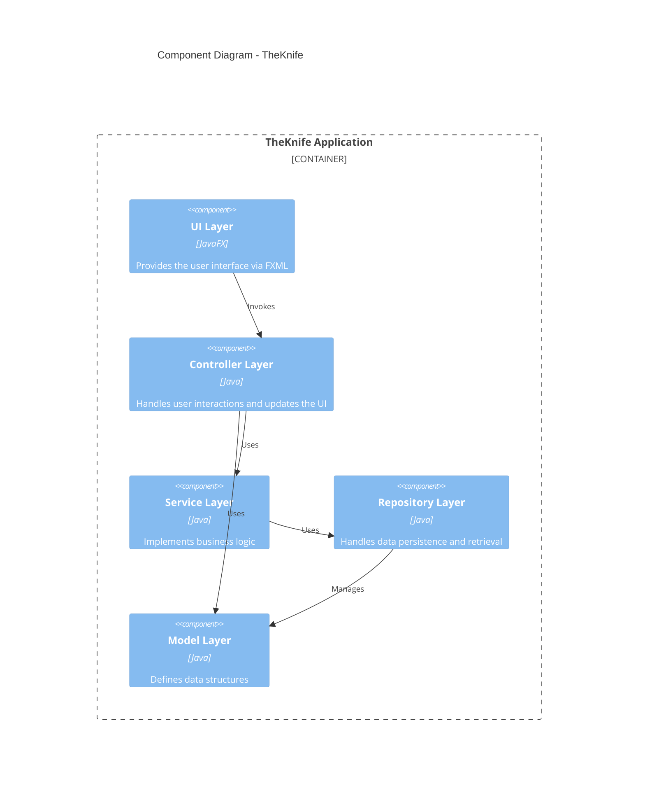

# TheKnife Project Analysis

## Project Overview

TheKnife is a Java-based restaurant information and review system built with JavaFX. The application appears to focus on Michelin restaurants, providing users with detailed restaurant information, reviews, and ratings. The system uses a Model-View-Controller (MVC) architecture and leverages modern Java features (Java 21) with Lombok for reduced boilerplate code.

## Architecture Analysis

### System Architecture


### Component Architecture



### Class Diagram


## Technical Analysis

### Technology Stack


### Design Patterns

Based on the analyzed code, the project implements several design patterns:

1. **MVC (Model-View-Controller)** - Separates the application into Model (data), View (UI), and Controller (business logic)
2. **Repository Pattern** - Abstracts data access through repository classes
3. **Builder Pattern** - Implemented via Lombok's @Accessors(chain = true) for fluent APIs
4. **Dependency Injection** - Likely used for service and repository dependencies

## Data Model Analysis

### Core Entities

- **Restaurant**: Represents a restaurant with detailed information
- **User**: Represents a system user with personal information and authentication details
- **Review**: Contains a user's review of a restaurant including ratings and content
- **Role**: Represents user roles for authorization
- **FilterOptions**: Represents the active set of filters applied by the user to the list of restaurants

### Detailed Entity Analysis

#### Restaurant
The Restaurant class is the central entity in the application, containing comprehensive information about Michelin restaurants:
- **Basic Information**: name, address, location, price range, cuisine type
- **Geographical Data**: longitude, latitude (used for distance calculations)
- **Contact Information**: phone number, website URL, Michelin URL
- **Michelin-specific Data**: award status, green star rating (for sustainability)
- **Additional Details**: facilities, description
- **Relationships**: associated reviews, owner (if applicable)

The class includes a nested Coordinate class for handling geographical positioning.

#### User
The User class represents application users with different roles:
- **Authentication Data**: username (unique identifier), password (stored in encrypted form)
- **Personal Information**: first name, last name, birth date, city
- **Role**: determines user permissions (customer, restaurant owner)
- **Relationships**: saved favorite restaurants

#### Review
The Review class connects users and restaurants through reviews:
- **Core Data**: content (text review), star rating (numerical score)
- **Relationships**: user (author), restaurant (subject)
- **Owner Response**: answer field for restaurant owner responses
- **Unique Identifier**: id field to uniquely identify each review

#### Role
The Role enum defines user permission levels:
- **CLIENTE**: Regular user who can browse restaurants and write reviews
- **RISTORATORE**: Restaurant owner who can manage restaurant information and respond to reviews

#### FilterOptions
The FilterOptions class enables restaurant filtering:
- **Filter Criteria**: cuisine, location, price, star rating
- **Service Filters**: delivery availability, online booking availability
- **Functionality**: provides methods to check if a restaurant matches all active filters

### Service Layer Analysis

The application implements several services to handle business logic:

#### SessionService
Central service managing application state:
- **User Session**: tracks the currently logged-in user
- **Navigation State**: manages the current view/scene and selected restaurant
- **Filter State**: stores active filter options
- **Data Cache**: maintains the list of loaded restaurants

#### SecurityService
Handles authentication security:
- **Password Encoding**: uses BCrypt hashing for secure password storage
- **Password Validation**: verifies user credentials during login

#### AlertService
Provides a unified interface for user notifications:
- **Alert Display**: shows information, warnings, and error messages
- **Consistent UI**: ensures uniform appearance of notification dialogs

### Repository Layer Analysis

The application uses repository classes to abstract data access:

#### RestaurantRepository
Manages restaurant data persistence:
- **Data Loading**: loads restaurant data from CSV (initial) and JSON (ongoing)
- **CRUD Operations**: provides methods to create, read, update, and delete restaurants
- **Search Functionality**: implements filtering and searching of restaurants

#### UserRepository
Handles user data persistence:
- **User Management**: stores and retrieves user information
- **Authentication Support**: provides methods for user lookup during login
- **Favorites Management**: handles saving and retrieving user's favorite restaurants

#### ReviewsRepository
Manages review data:
- **Review Storage**: persists review data to JSON files
- **Restaurant-Review Association**: maintains the relationship between restaurants and their reviews
- **Owner Responses**: supports storing restaurant owner responses to reviews

### Data Flow

```mermaid
flowchart LR
    subgraph CSV["CSV Data"] 
      restaurants_csv["Initial Restaurant Data"]
    end

    subgraph JSON["JSON Data"] 
      restaurants_json["Restaurant Data"]
      users["User Data"]
      reviews["Review Data"]
    end

    subgraph Application
      subgraph repos["Repository Layer"]
        restaurant_repo["RestaurantRepository"]
        user_repo["UserRepository"]
        reviews_repo["ReviewsRepository"]
      end

      subgraph services["Service Layer"]
        session_service["SessionService"]
        security_service["SecurityService"]
        alert_service["AlertService"]
      end

      subgraph controllers["Controller Layer"]
        home_controller["HomeController"]
        login_controller["LoginController"]
        register_controller["RegisterController"]
        restaurant_controller["RestaurantController"]
        filters_controller["FiltersController"]
      end

      views["Views (FXML)"] 
    end

    restaurants_csv --> restaurant_repo
    restaurants_json --> restaurant_repo
    users --> user_repo
    reviews --> reviews_repo

    restaurant_repo --> restaurants_json
    user_repo --> users
    reviews_repo --> reviews

    restaurant_repo --> session_service
    user_repo --> security_service
    reviews_repo --> restaurant_controller

    session_service --> home_controller
    session_service --> restaurant_controller
    session_service --> filters_controller
    security_service --> login_controller
    security_service --> register_controller
    alert_service --> controllers

    controllers --> views
    views --> controllers
```

## Feature Analysis

### Core Features

1. **Restaurant Browsing**: Users can view a list of restaurants with details
2. **Restaurant Details**: Detailed view of restaurant information
3. **User Management**: Registration, login, and profile management
4. **Review System**: Users can read and write restaurant reviews
5. **Favorites/Bookmarks**: Users can save favorite restaurants

### User Flow

