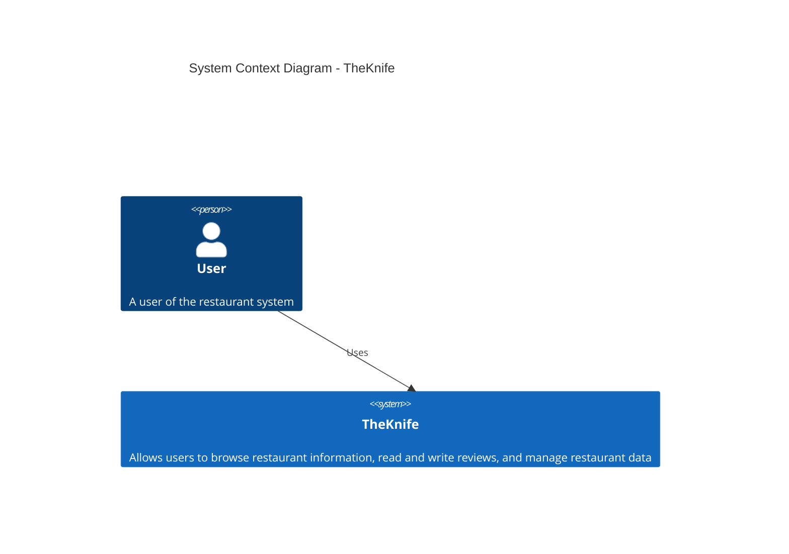
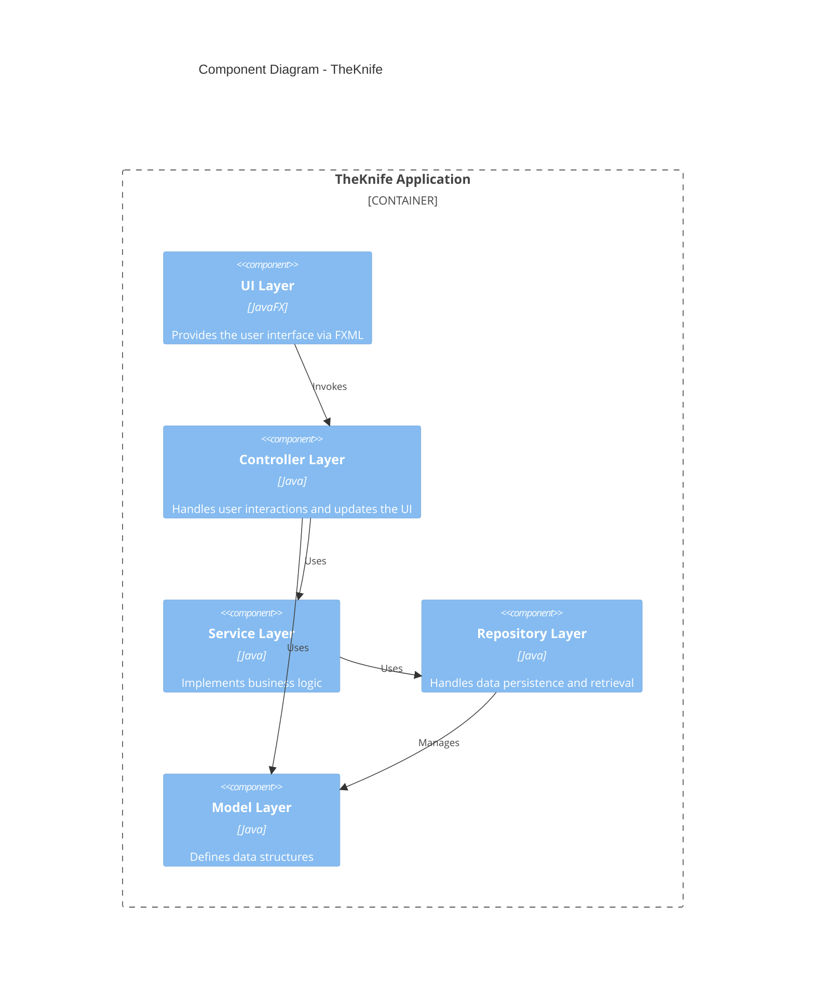
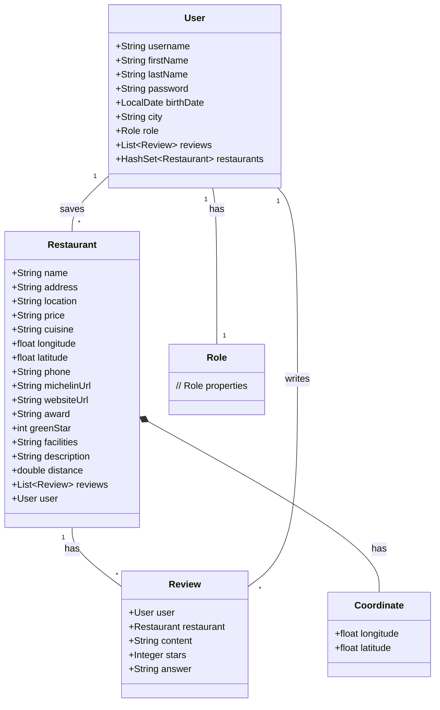
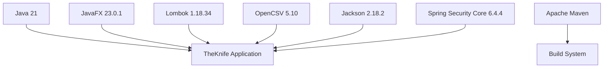
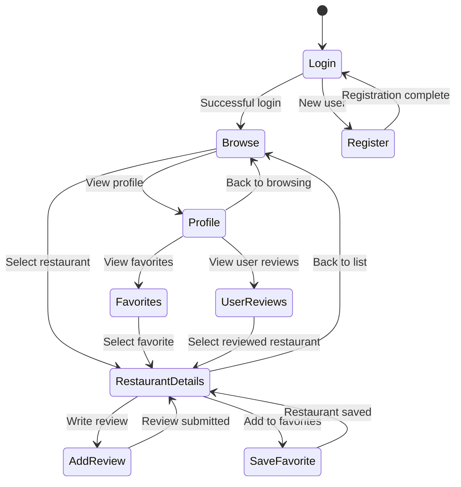
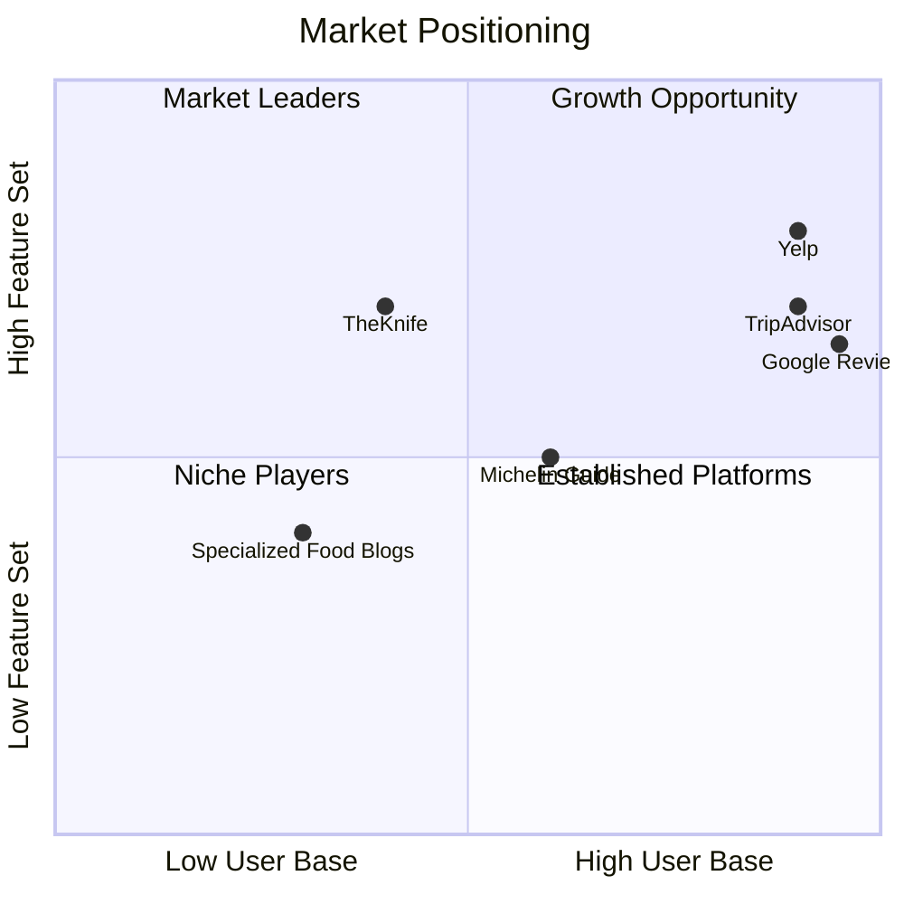

# TheKnife Project Analysis

## Project Overview

TheKnife is a Java-based restaurant information and review system built with JavaFX. The application appears to focus on Michelin restaurants, providing users with detailed restaurant information, reviews, and ratings. The system uses a Model-View-Controller (MVC) architecture and leverages modern Java features (Java 21) with Lombok for reduced boilerplate code.

## Architecture Analysis

### System Architecture



### Component Architecture



### Class Diagram



## Technical Analysis

### Technology Stack



### Design Patterns

Based on the analyzed code, the project implements several design patterns:

1. **MVC (Model-View-Controller)** - Separates the application into Model (data), View (UI), and Controller (business logic)
2. **Repository Pattern** - Abstracts data access through repository classes
3. **Builder Pattern** - Implemented via Lombok's @Accessors(chain = true) for fluent APIs
4. **Dependency Injection** - Likely used for service and repository dependencies

## Data Model Analysis

### Core Entities

- **Restaurant**: Represents a restaurant with detailed information
- **User**: Represents a system user with personal information and authentication details
- **Review**: Contains a user's review of a restaurant including ratings and content
- **Role**: Represents user roles for authorization

### Data Flow

```mermaid
flowchart LR
    subgraph CSV["CSV Data"] 
      restaurants["Restaurant Data"]
    end

    subgraph JSON["JSON Data"] 
      users["User Data"]
      reviews["Review Data"]
    end

    subgraph Application
      repos["Repositories"]
      services["Services"]
      controllers["Controllers"]
      views["Views (FXML)"] 
    end

    restaurants --> repos
    users --> repos
    reviews --> repos
    repos --> services
    services --> controllers
    controllers --> views
```

## Feature Analysis

### Core Features

1. **Restaurant Browsing**: Users can view a list of restaurants with details
2. **Restaurant Details**: Detailed view of restaurant information
3. **User Management**: Registration, login, and profile management
4. **Review System**: Users can read and write restaurant reviews
5. **Favorites/Bookmarks**: Users can save favorite restaurants

### User Flow



## Technical Debt & Considerations

### Strengths

1. **Modern Java Usage**: Leverages Java 21 with modern features
2. **Clean Architecture**: Clear separation of concerns with MVC pattern
3. **Reduced Boilerplate**: Effective use of Lombok for concise code
4. **Type Safety**: Strong typing throughout the application

### Potential Improvements

1. **Persistence Strategy**: The application appears to use CSV and potentially JSON for data storage. A relational or NoSQL database might offer better scaling and data integrity.
2. **Test Coverage**: Additional information on test coverage would help assess reliability.
3. **API Documentation**: More detailed API documentation would aid in maintenance.
4. **Localization**: Support for multiple languages could expand the user base.

## Product Analysis

### Target Users

1. **Food Enthusiasts**: People interested in high-quality dining experiences
2. **Travelers**: Users looking for dining options in different locations
3. **Restaurant Critics**: Professional or amateur critics sharing their opinions
4. **Restaurant Owners**: Monitoring and responding to reviews

### Value Proposition

TheKnife provides a comprehensive platform focused on Michelin restaurants, offering:

1. **Curated Content**: Focus on high-quality restaurants with Michelin recognition
2. **Community Reviews**: Real user experiences and ratings
3. **Detailed Information**: Comprehensive restaurant details including facilities, awards, and pricing
4. **Personalization**: User accounts with saved favorites and review history

### Market Positioning



## Development Roadmap Recommendations

### Short-term (3-6 months)

1. **Mobile Application**: Develop companion mobile apps for iOS and Android
2. **Advanced Search**: Implement filtering by cuisine, price range, and distance
3. **Reservation Integration**: Add ability to make restaurant reservations
4. **Social Sharing**: Allow sharing of reviews and restaurants on social media

### Mid-term (6-12 months)

1. **API Development**: Create public API for third-party integrations
2. **Enhanced Analytics**: Provide restaurant owners with review analytics
3. **Personalized Recommendations**: Suggest restaurants based on user preferences
4. **Offline Support**: Allow browsing restaurants and reviews offline

### Long-term (1-2 years)

1. **Expansion Beyond Michelin**: Include other quality restaurants
2. **International Support**: Multiple languages and region-specific features
3. **AR Integration**: Augmented reality view for finding restaurants
4. **AI-Powered Recommendations**: Machine learning for personalized content

## Conclusion

TheKnife is a well-structured Java application built with modern technologies that provides a comprehensive platform for restaurant discovery and reviews with a focus on Michelin establishments. The application demonstrates good software architecture principles and offers a solid foundation for future enhancements.

The project could benefit from some modernization in data storage strategies and expanded testing, but overall shows strong technical design and clear separation of concerns. From a product perspective, focusing on the unique value proposition of curated, high-quality restaurant information with detailed reviews sets it apart from general restaurant review platforms.
